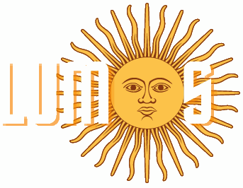
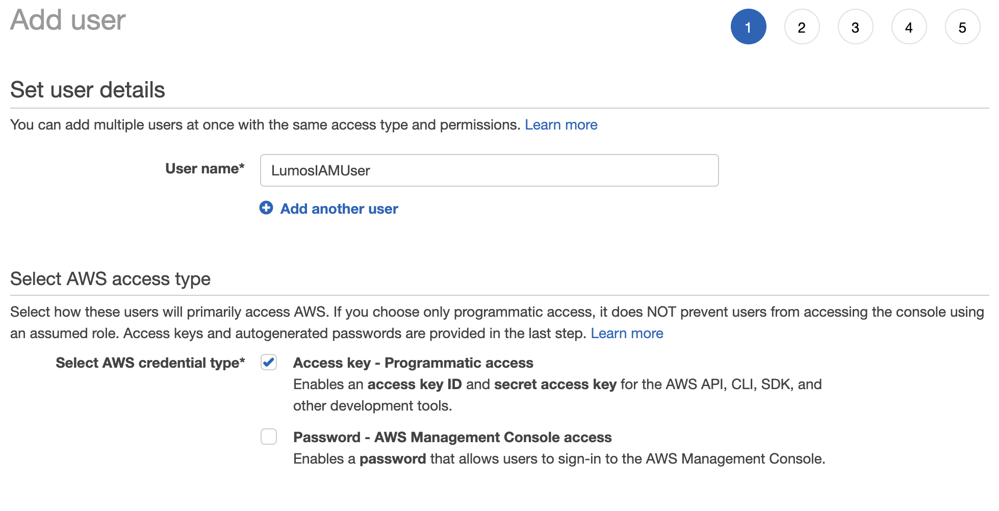
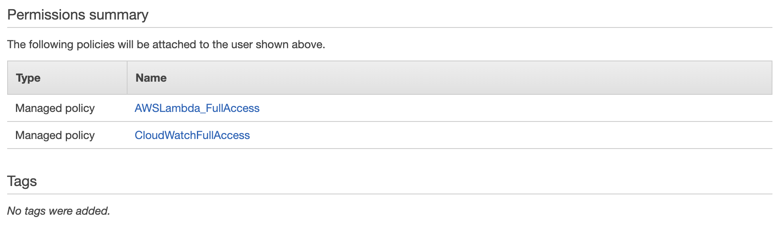

<!-- PROJECT LOGO -->
 

    
    <h1>Lumos Lambda Metrics Visualizer</h1>

<!-- TABLE OF CONTENTS -->

  
Table of Contents

  <ol>
    <li><a href="#about-lumos">About Lumos</a></li> 
    <li><a href="#technologies-used">Techologies Used</a></li>      
    <li><a href="#getting-started">Getting Started</a></li>      
    <li><a href="#key-lambda-metrics">Key Lambda Metrics</a></li>   
    <li><a href="#how-to-contribute">How to Contribute</a></li>     
    <li><a href="#license">License</a></li>
    <li><a href="#contributors">Contributors</a></li>
  </ol>

<!-- ABOUT -->

## About Lumos

Serverless architecture is an integral benefit of cloud computing which allows developers to build and run services without having to manage the underlying infrastructure. Amazon Web Services' (AWS) Lambda is the dominant service in the serverless market and is relied upon by the world's largest companies due to its cost-effective, event-driven service that runs code in response to events and automatically manages the computing resources required by that code.

One drawback to using AWS's services is that navigating the AWS console can be quite challenging. Additionally, lack of descriptive documentation pertaining to AWS's Lambda service makes it difficult to visualize key function metrics at a glance. To solve this, we built Lumos, a free and open-source AWS lambda monitoring tool that allows users to connect their AWS account to track and visualize their key lambda metrics on a visually appealing UI.

## Technologies Used

- [React](https://reactjs.org/)
- [Material-UI](https://material-ui.com)
- [Chart.js](https://www.chartjs.org/)
- [AWS Lambda](https://aws.amazon.com/lambda/)
- [AWS SDK](https://aws.amazon.com/sdk-for-javascript/)
- [AWS STS](https://docs.aws.amazon.com/STS/latest/APIReference/welcome.html)
- [AWS CloudWatch](https://aws.amazon.com/cloudwatch/)
- [Node](https://nodejs.org/en/)
- [Express](https://expressjs.com)
- [PostgreSQL](https://postgresql.org)
- [Webpack](https://webpack.js.org/)
- [Bcrypt](https://www.npmjs.com/package/bcrypt)
- [JSON Web Token](https://jwt.io/)

<!-- GETTING STARTED -->

## Getting Started

Lumos requires access keys to sign programmatic requests to the AWS SDK. It is best practice to create an IAM user with permanent long-term credentials to interact with AWS services directly.

1. In your AWS console, create an new IAM user. Make sure to check off "Access key - Programmatic access" when selecting an AWS credential type. Save these keys in a secure location. **_They cannot be retrieved after you've completed your IAM setup!_** If you lose your key, you will have to delete the access key and create a new one.

- 

2. Attach two existing policies directly to your IAM user's security policy:

- 

3. [Download and install the AWS CLI.](https://docs.aws.amazon.com/cli/latest/userguide/getting-started-install.html)

4. From your terminal, access the AWS CLI by typing in
   `aws configure`. Follow the steps on your screen and input your access key ID and secret access key.

<!-- EXPLAINING KEY LAMBDA METRICS FOCUSED ON -->

## Key Lambda Metrics

The key lambda metrics we found to be of most interest to users were invocations, durations, and errors. One can visualize their lambda functions metrics across three different time periods: 24 hours, 1 week, or 1 month. Users can visualize their insights through two charts: donut and line. A donut chart will give an overview of all active invocations relating to the functions. The line chart will give a visualization of the number of times each lambda function has been invoked across selected time periods. Lumos also approximates the total cost of a user's lambda functions based on the function's duration and memory usage.

<!-- CONTRIBUTING -->

## How to Contribute

At Lumos, we open-sourced the project with the intention of having amazing people iterate on our project.

If you have any suggestions on how to make Lumos better, please follow the steps below:

1. Fork Lumos
2. Create your Feature Branch (`git checkout -b feature/YourFeature`)
3. Add your changes using (`git add .`)
4. Commit your Changes (`git commit -m 'Add Your Feature'`)
5. Push to the Branch (`git push origin feature/YourFeature`)
6. Open a Pull Request
7. Hit the star button!!

Thank you and we truly appreciate all your contributions!

<!-- LICENSE -->

## License

Distributed under the MIT License.

<!-- CONTACT -->

## Contributors

- Adithya Chandrashekar [Github](https://github.com/addychandrashekar) | [Linkedin](https://www.linkedin.com/in/addyc/)
- Adnan Pervez [Github](https://github.com/apervez) | [Linkedin](https://www.linkedin.com/in/adnan-pervez)
- Carmen Hu [Github](https://github.com/BadWithNames) | [Linkedin](https://www.linkedin.com/in/hu-carmen)
- Mario Arraya [Github](https://github.com/marioarraya) | [Linkedin](https://www.linkedin.com/in/mario-arraya/)
- Michael Negron [Github](https://github.com/InternalShadow) | [Linkedin](https://www.linkedin.com/in/MichaelVNegron)
